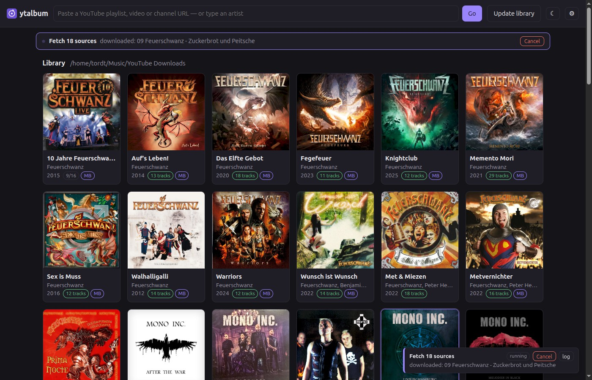
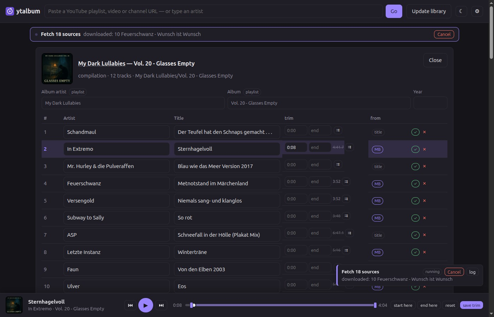
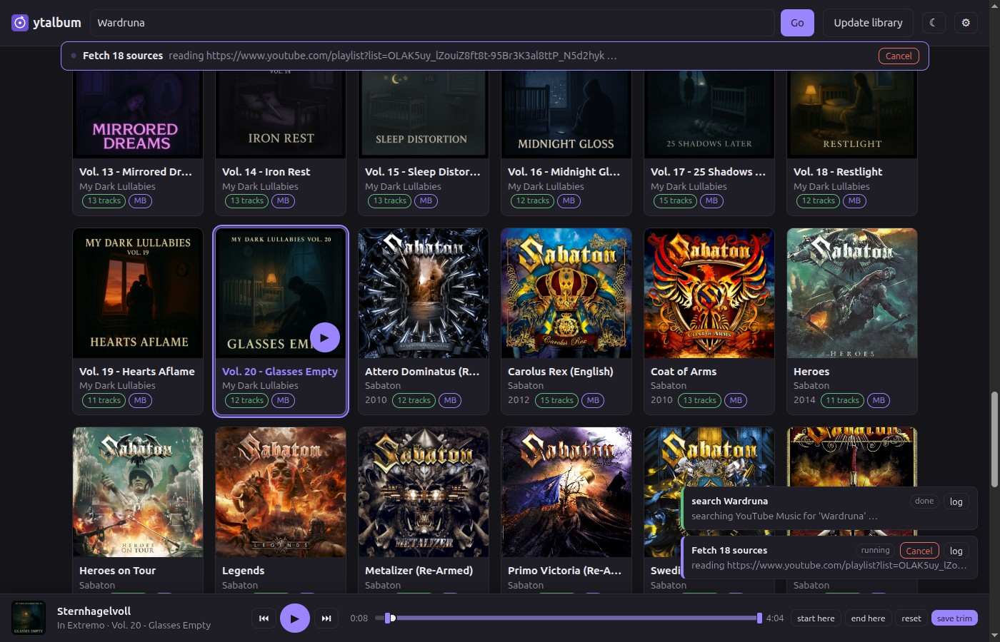
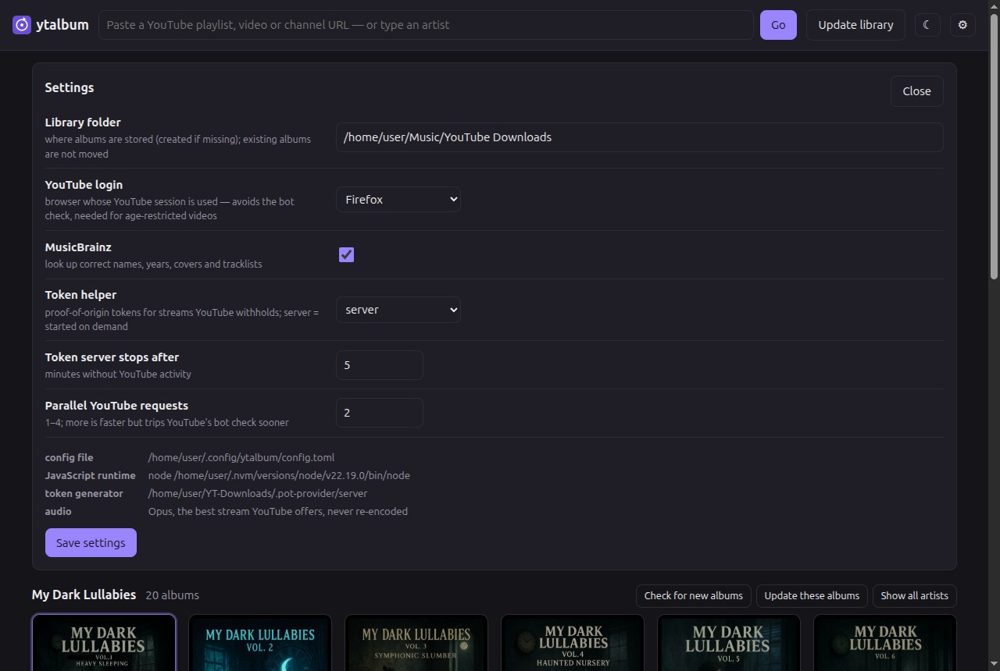

<h1> ytalbum</h1>

[](https://github.com/smtws/ytalbum/actions/workflows/tests.yml)
[](LICENSE)

Turn YouTube playlists into properly tagged albums: correct artist and title per track,
album art, MusicBrainz data where it exists, and the audio copied without re-encoding.
Comes with a command line and a small web app for the library.



## What it does

- **You give it a URL or a name.** A playlist, a video, a channel, or just an artist name.
- **It works out what kind of thing that is:** an official album, an artist's playlist, a
  curated compilation (14 songs by 14 bands), or a single.
- **It finds the real artist and title per track.** YouTube Music's own fields first, then
  the video title (stripping "(Official Video)", label suffixes and the like), then
  MusicBrainz — which also fixes reversed "Song - Artist" titles.
- **The artist field stays the performer.** A guest credit moves into the title
  (`Feuerschwanz` / `Ding (SEEED Cover) ft. Melissa Bonny`), so a collaboration does not
  become an artist of its own, and one artist keeps one spelling across the library.
- **It downloads the best audio YouTube has** (Opus, usually 130–160 kbps) and never
  re-encodes it.
- **It tags everything**, embeds the cover and files it as
  `Album artist/Album/Album artist - Album - 07 - [Track artist - ]Title.opus`.
- **Every value knows where it came from** (MusicBrainz, YouTube Music, the video title,
  or you), and anything you edit yourself is never overwritten by a later update.
- **Re-runs are cheap.** An update checks each album with a single request and only does
  real work when the playlist actually changed.
- **You can find what you have.** Filter the library by album, artist **or song** — matches
  are highlighted, and one button plays them, across albums.

## Install

Needs **Python ≥ 3.14**, [uv](https://docs.astral.sh/uv/), [ffmpeg](https://ffmpeg.org/)
and a JavaScript runtime for yt-dlp ([Node](https://nodejs.org/) ≥ 20,
[deno](https://deno.com/) or bun).

```sh
sudo apt install ffmpeg nodejs                      # Debian/Ubuntu; brew install ffmpeg node on macOS
curl -LsSf https://astral.sh/uv/install.sh | sh     # if you do not have uv yet

git clone https://github.com/smtws/ytalbum.git
cd ytalbum
uv sync                                             # venv + dependencies
uv run ytalbum config                               # shows what it found: ffmpeg, JS runtime, token helper
```

`uv sync` needs no system Python 3.14 — uv fetches the interpreter itself.

## First run

```sh
uv run ytalbum config --library ~/Music/YouTube        # once
uv run ytalbum fetch "https://www.youtube.com/playlist?list=…"
uv run ytalbum serve                                   # web UI on http://localhost:8765
```

To have the web UI always there without a terminal (Linux):

```sh
uv run ytalbum service install    # systemd user socket: starts on the first request, idles out
uv run ytalbum app install        # menu entry with its own window and icon
```

The library, the CLI and the web UI are platform-independent; `ytalbum service` (systemd)
and `ytalbum app` (freedesktop launcher) are Linux-only.

**YouTube's bot check.** After a few hundred requests YouTube starts refusing everything
("Sign in to confirm you're not a bot"). A logged-in browser session avoids that:

```sh
uv run ytalbum config --cookies-from-browser firefox   # or chrome, or --cookies-file cookies.txt
```

**Proof-of-origin tokens.** Some videos only hand out their audio streams when the client
presents a token. Set the generator up once (versions must match the installed
`bgutil-ytdlp-pot-provider`, currently 2.0.0):

```sh
git clone --single-branch --branch 2.0.0 https://github.com/Brainicism/bgutil-ytdlp-pot-provider.git .pot-provider
(cd .pot-provider/server && npm ci && npx tsc)
```

ytalbum finds it, starts a local token server when it needs one and stops it after five
idle minutes.

## Screenshots

| | |
|---|---|
|  |  |
| **Album view:** cover, editable fields, where each value came from, disc and trim points, per-track delete. A compilation keeps one artist per track; playing a track adds a position bar with trim handles. | **A URL or an artist name:** here a curator's channel — every playlist it publishes, track counts filled in afterwards, "in library" markers, tick what you want. |
|  |  |
| **Settings:** library folder, YouTube login, MusicBrainz, token helper, parallel requests — and what it found: config file, JS runtime, token generator. | **Library:** one artist's albums, narrowed further by the filter with the matches highlighted, ▶ plays all of them, and "check for new albums" asks YouTube for that artist alone. |

The compilations throughout these screenshots are
[**My Dark Lullabies**](https://www.youtube.com/@MyDarkLullabies) — *"a curated collection
of sleep playlists for restless minds, melancholic souls, and lovers of the night"*, one
themed volume at a time, from darkwave and neofolk to doom and ritual ambient. It is
another AI-assisted project by this repository's owner, and it is the reason half of this
tool exists: twenty volumes of thirteen different bands each, where no release, no
tracklist and no cover exists to look up — so the names have to be earned from the video
titles and MusicBrainz one track at a time.

## How it works

```
URL ─► resolve ─► inspect ─► classify ─► enrich ─► plan ─► [you edit] ─► download ─► tag
```

Each album folder holds a **plan** (`.ytalbum.json`): what the source listed, what each
track should be called, where every value came from, what has been downloaded, and which
trim points apply. The plan is the only state — delete it and the album is just files;
keep it and everything is repeatable.

- **Your edits win.** The plan records the value ytalbum derived. A value that differs from
  it is yours and survives every update; untouched values follow better data when it
  appears.
- **Nothing is decided on half-knowledge.** If any video can't be read (bot check, network),
  the run changes nothing at all instead of classifying or renaming from a partial view.
- **Trimming is non-destructive.** The untouched original goes to `.originals/`, cuts are
  made from it with `ffmpeg -c copy`, and clearing the trim restores it byte for byte.

More detail, including what was measured and deliberately rejected, is in
[DESIGN.md](DESIGN.md).

### On disk

```
Library/
└── My Dark Lullabies/
    └── Vol. 1 - Heavy Sleeping/
        ├── My Dark Lullabies - Vol. 1 - Heavy Sleeping - 01 - Enemy Inside - Lullaby.opus
        │                                             ↑ "1-01" on an album with several discs
        ├── …
        ├── cover.jpg              # replace it with your own and ytalbum keeps it
        ├── .ytalbum.json          # the plan
        └── .originals/            # only when trims are in use
```

## Command line

| Command | What it does |
|---|---|
| `ytalbum fetch <url>` | Plan and download a playlist, video or channel. `--dry-run` prints the plan only, `--pick 1,3-5` / `--all` choose from a channel, `--no-mb` skips MusicBrainz, `--library PATH` overrides the library, `--dump-collection FILE` also saves what YouTube returned (for test fixtures). |
| `ytalbum search <artist>` | Find an artist's albums, singles and playlists and pick from them (`--pick`, `--all`, `--dry-run`). |
| `ytalbum plan <url>` | Write the plan into the album folder without downloading, for editing by hand. |
| `ytalbum download <album-folder>` | Run an (edited) plan: fetch what is missing, rename, retag, trim. |
| `ytalbum update` | Re-check every album against its source. `--dry-run` only reports, `--deep` reads every album fully instead of skipping unchanged ones, `--no-mb` skips MusicBrainz. |
| `ytalbum prune <album-folder>` | Delete tracks that are no longer in the source playlist (asks first, `--yes` skips). |
| `ytalbum delete <album-folder>` | Delete an album, or one track with `--track <video-id>` (asks first, `--yes` skips). |
| `ytalbum serve` | Web UI. `--host 0.0.0.0` exposes it to the network (**no login!**), `--port`, `--idle-exit SECONDS`. |
| `ytalbum service install\|status\|restart\|uninstall` | Run the web UI on demand via a systemd **user** socket: the first request starts it, it stops itself when idle. `restart` refuses while a job runs unless given `--force`. |
| `ytalbum app install\|status\|uninstall` | Desktop launcher (Linux) that opens the UI in a window of its own instead of another browser window. `--remove-profile` on uninstall also drops the app's browser profile. |
| `ytalbum repair` | One-off, offline: performer-only artist names, guest credits moved into the title, the album's own name removed from its track titles, one spelling per artist, duplicate tracks removed — renames and retags, no downloads. |
| `ytalbum config` | Show or change settings: `--library`, `--cookies-from-browser BROWSER[:PROFILE]`, `--cookies-file FILE`. |

Exit codes: `0` fine, `1` something failed, `2` wrong usage, `3` YouTube is blocking
requests, `130` interrupted.

## Web UI and HTTP API

`ytalbum serve` listens on `127.0.0.1:8765`, serves the app and a small JSON API. The app
is a single HTML page with no build step, and it can be installed as a PWA.

Installing it from the browser works, but the window keeps the browser's window class
(Chrome reports `WM_CLASS = "crx_<app-id>", "Google-chrome"`), and desktops group the
taskbar by that class — so it appears as another browser window, with the browser's icon.
No manifest setting changes this; the class comes from the browser process. `ytalbum app
install` writes a launcher that starts the browser with `--class=ytalbum` and a profile
directory of its own (the flag is only honoured by a browser process of its own), giving
the app its own taskbar entry and icon.

**The library view** sorts by artist, then year, then name — a discography reads
chronologically, and compilations without a year keep their natural order (Vol. 1 … Vol. 20).
A rail of initials down the side jumps to the first album of a letter (it appears once three
or more are in view), and a button returns to the top of a long library.
<kbd>/</kbd> jumps to the filter, which searches albums, artists and song titles at once:
matching text is highlighted, <kbd>Enter</kbd> moves into the results, <kbd>Esc</kbd> clears
it, and **▶ Play** queues everything it found. Opening an album from a filtered view tints
the fields that matched — an input's value cannot be highlighted character by character, so
the whole field is marked instead. Matching ignores case, accents and punctuation, including
the letters Unicode cannot fold (`njord` finds *Njǫrð*) and umlauts typed the German way
(`knueppel` finds *Knüppel*).

**Safety:** localhost only by default; writing calls need the header `X-Ytalbum: 1` and a
JSON content type (so other websites cannot use it through your browser); the `Host` header
must be ours (DNS rebinding); files are only ever served by album and video id, never by a
path from the request; strict CSP, and thumbnails are fetched by the server so the page
never talks to Google. There is **no authentication** — do not expose it to an untrusted
network.

### Reading

| Endpoint | Returns |
|---|---|
| `GET /api/state` | Library (albums with progress), recent jobs, settings, whether something is running. |
| `GET /api/album?id=<source-id>` | The full plan of one album. |
| `GET /api/tracks` | Every track by album as compact rows (video id, artist, title, downloaded, trim points), with a version that changes when any plan does — what the library filter searches and plays. |
| `GET /api/cover?id=<source-id>` | The album's cover image. |
| `GET /api/thumb?u=<url>` | A thumbnail, fetched by the server (allow-listed hosts only, cached). |
| `GET /api/audio?id=<source-id>&v=<video-id>` | The track's audio, with `Range` support so players can seek. |
| `GET /api/job?id=<n>` | One job with its full log and result. |

### Writing (POST, JSON body, header `X-Ytalbum: 1`)

| Endpoint | Body | Effect |
|---|---|---|
| `/api/open` | `{q}` | A URL or an artist name: preview, channel listing or search (read-only lane). |
| `/api/fetch` | `{urls: […]}` | Plan and download those sources. |
| `/api/update` | `{artist?, deep?}` | Re-check the library, or one artist's albums. |
| `/api/edit` | `{id, edits}` | Album and track fields, trim points, audio choice; renames and retags. |
| `/api/trim_channel` | `{channel, start, end}` | The same trim for every track from one uploader. |
| `/api/prune` | `{id}` | Delete tracks that left the playlist. |
| `/api/delete_track` | `{id, video_id}` | Delete one track. |
| `/api/delete_album` | `{id}` | Delete an album (files ytalbum owns; anything else is kept). |
| `/api/details` | `{refs: [{id, url}]}` | Ask for track counts and covers of search hits; a background runner fills them in. |
| `/api/cancel` | `{id}` | Cancel a job; it stops at the next point where nothing is half-done. |
| `/api/settings` | see below | Change settings at runtime. |

Jobs run in two lanes: everything that changes the library runs strictly one at a time,
while searches and previews run alongside.

## Configuration

`~/.config/ytalbum/config.toml` (or `$XDG_CONFIG_HOME`), all keys optional:

| Key | Default | Meaning |
|---|---|---|
| `library_root` | – | Where albums are stored. |
| `cookies_from_browser` | – | `firefox`, `chrome`, `chrome:Profile 1`, … |
| `cookies_file` | – | An exported `cookies.txt` instead. |
| `musicbrainz` | `true` | Look up names, years, covers, tracklists. |
| `concurrency` | `2` | Parallel YouTube requests. More trips the bot check sooner. |
| `pot_mode` | `"server"` | Token helper: `server` (started on demand), `script`, `off`. |
| `pot_port`, `pot_idle` | `4416`, `300` | Token server port and idle timeout in seconds. |
| `pot_provider_home` | `.pot-provider/server` | Where the token generator is built. |
| `js_runtime`, `js_runtime_path` | autodetect | deno, node, bun or quickjs for yt-dlp. |

## Limits

- **YouTube decides the quality.** Opus at 130–160 kbps, lossy, and from whatever the
  uploader provided. No setting can make that better, and FLAC it will never be.
- **Some videos have no audio-only stream** (old or low-quality uploads). YouTube also
  withholds the audio formats now and then for videos that do have them, which looks
  identical — so ytalbum asks twice before believing it, and the dialog says to re-check the
  source before accepting the fallback: copying the audio out of the combined video into an
  `.m4a` is your choice, never automatic.
- **Some uploads need a paid tier.** YouTube Music Premium exclusives (audio plays, for
  instance) cannot be read without a subscription. ytalbum then writes nothing at all rather
  than an album with no tracks, and an album already downloaded is never touched by a later
  update that can no longer read its source.
- **The track order is yours if you change it.** Edit the position of a track and the album
  keeps that order through every later update; a video that appears afterwards joins the end
  instead of pushing your arrangement around. Until you change it, the source decides.
- **Multi-disc albums** are supported — file names carry `1-07`, `discnumber` is tagged, and
  a split survives updates. The album view has a disc column after the title, on
  every album, and each disc is numbered from 1 again when you change it.
- **The bot check** can stop any run. ytalbum then changes nothing and asks you to try
  later; a browser login makes it rare.
- **It only knows its own library.** Music you already own elsewhere is invisible to it, so
  it cannot warn you about duplicates.
- **No authentication** in the web UI (see above).

## Where this comes from

The repository has three generations, all in its history:

1. **v1** (Sept 2025, branch history): a Tkinter desktop app with a large search engine —
   seven strategies, Google and YouTube Music scraping. It never produced a finished album.
2. **v2** (`pwa` branch): a FastAPI + Vue rewrite, search only, abandoned mid-way. Its
   central number, the "track count", was read from a yt-dlp field that actually reports the
   size of the surrounding list — the bug that sent the project into a fix/break loop.
3. **v3** (`main`, this code): rebuilt from scratch on 22 September 2026 after an
   analysis of both predecessors. [DESIGN.md](DESIGN.md) records that analysis, the verified
   facts about yt-dlp and YouTube, every decision, and the ideas that were measured and
   dropped (automatic intro detection, for one).

### A note on how it was written

This project doubles as an evaluation of what an autonomous coding AI can do. All three
generations were written by AI assistants; v3 was built in a single day-long session with
[Claude Code](https://claude.com/claude-code) (Claude Opus 5), with the repository owner
directing the work, testing in the real world and correcting course.

Whether that is visible in the result is for you to judge. What the session enforced, and
what is worth copying regardless of who writes the code, is written down in DESIGN.md §10:
fix wrong data where it enters instead of patching symptoms, capture a fixture and write a
test before fixing, never tune heuristics to a single example, and verify against reality
rather than assumptions — several features in this tool exist in the shape they do because
a measurement contradicted the plan.

## Built on

[yt-dlp](https://github.com/yt-dlp/yt-dlp) ·
[MusicBrainz](https://musicbrainz.org/) and the [Cover Art Archive](https://coverartarchive.org/) ·
[bgutil-ytdlp-pot-provider](https://github.com/Brainicism/bgutil-ytdlp-pot-provider) ·
[mutagen](https://mutagen.readthedocs.io/) ·
[Pillow](https://python-pillow.org/) ·
[httpx](https://www.python-httpx.org/) ·
[ffmpeg](https://ffmpeg.org/) ·
[uv](https://docs.astral.sh/uv/)

Please respect MusicBrainz' [rate limits](https://musicbrainz.org/doc/MusicBrainz_API/Rate_Limiting)
(ytalbum does) and download only what you are allowed to.

**If this saved you time, give it to the projects underneath it, not to me.** Half the names
in your library come from MusicBrainz, whose non-profit [MetaBrainz Foundation](https://metabrainz.org/donate)
runs on donations; and nothing here works for a week without
[yt-dlp](https://github.com/yt-dlp/yt-dlp), which keeps up with YouTube so that this tool
does not have to. This repository takes no donations and has no sponsor button.

## Licence

[MIT](LICENSE) for this code.

Two dependencies are copyleft and are installed separately by `uv`/`pip`, not shipped
here: **mutagen** (GPL-2.0-or-later, used for tagging) and **bgutil-ytdlp-pot-provider**
(GPL-3.0). Using and modifying ytalbum from source is unaffected — but a *bundle* that
contains them (a PyInstaller binary, a container image) is a combined work and has to be
distributed under the GPL.

## Tests

```sh
uv run pytest        # 295 tests, offline, ~12 s
```

They run against recorded YouTube and MusicBrainz responses in `design-fixtures/`, so they
need no network and no credentials. Every bug found in real use has a fixture and a test.
The same suite runs on every push via GitHub Actions.

Bug reports are welcome — see [CONTRIBUTING.md](CONTRIBUTING.md) for what makes one useful
and what this project does with pull requests.
