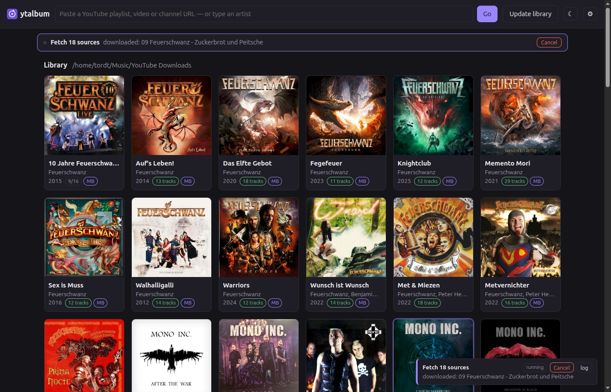
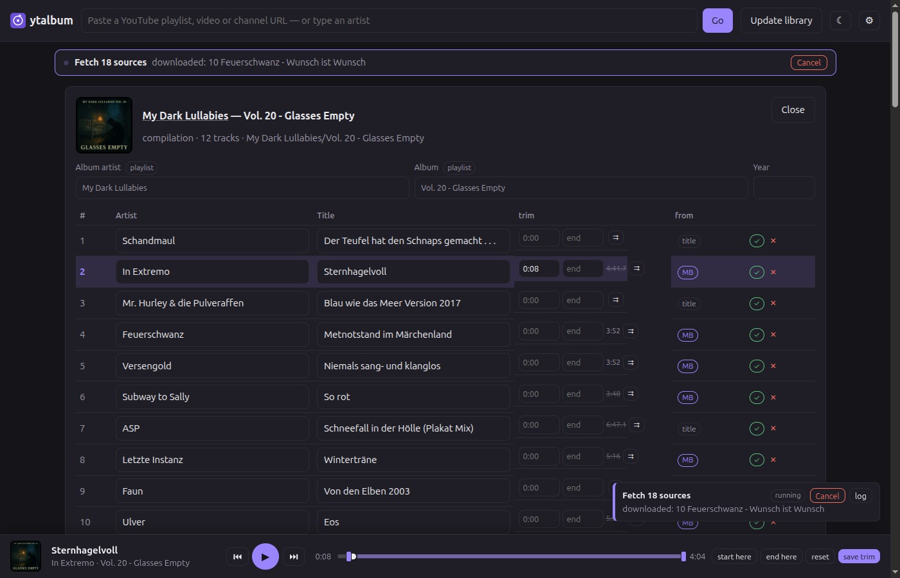
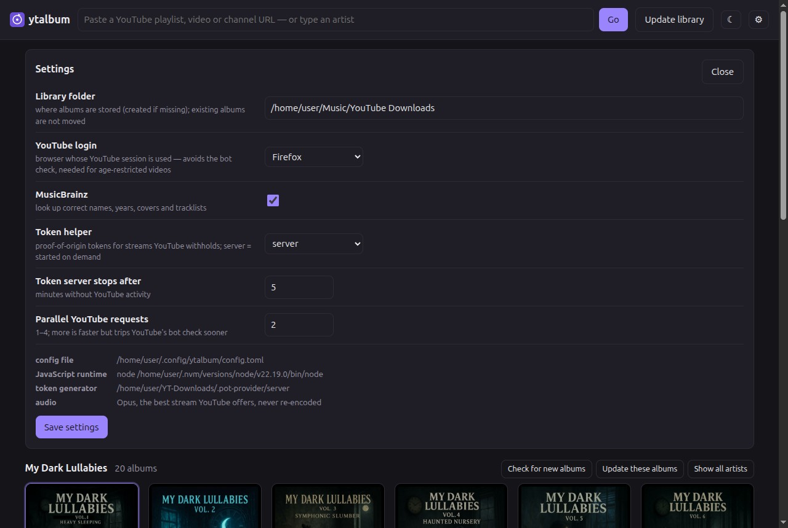
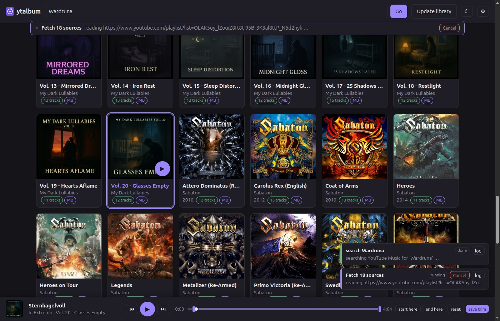

<h1> ytalbum</h1>

[](https://github.com/smtws/ytalbum/actions/workflows/tests.yml)
[](LICENSE)

> ### ytalbum is now **noaap** — <https://github.com/smtws/noaap>
>
> Same program, same history, new name (*Not Officially An Audio Player*). **0.9.1 is the last
> release under this name** and this repository is archived; everything after it happens there.
>
> **Nothing has to be converted.** noaap writes the same `.ytalbum.json` — that file is the
> format's name, not the program's — so a library moves across untouched, and ytalbum 0.9.0 can
> still read a library noaap has written to. On this machine it also reads
> `~/.config/ytalbum/config.toml` and accepts every `YTALBUM_*` variable, each with one line of
> notice; `noaap migrate` ends the borrowing and removes nothing of ytalbum's unless asked.

Turn YouTube playlists into properly tagged albums: correct artist and title per track,
album art, MusicBrainz data where it exists, and the audio copied without re-encoding.
Comes with a command line and a small web app for the library.



## What it does

- **You give it a URL or a name.** A playlist, a video, a channel, or just an artist name.
- **It works out what kind of thing that is:** an official album, an artist's playlist, a
  curated compilation (14 songs by 14 bands), or a single.
- **It finds the real artist and title per track.** YouTube Music's own fields first, then
  the video title (stripping "(Official Video)", label suffixes and the like), then
  MusicBrainz — which also fixes reversed "Song - Artist" titles.
- **One artist, one spelling.** A MusicBrainz credit is how a release is printed, so it can
  shout ("Visions **Of** Atlantis" on three releases of seven); the artist's own spelling wins
  whenever the two differ only in case or punctuation, while a genuinely different credited
  name (an old release as "Puff Daddy") is kept.
- **The artist field stays the performer.** A guest credit moves into the title
  (`Feuerschwanz` / `Ding (SEEED Cover) ft. Melissa Bonny`), so a collaboration does not
  become an artist of its own, and one artist keeps one spelling across the library.
- **It downloads the best audio YouTube has** (Opus, usually 130–160 kbps) and never
  re-encodes it.
- **It tags everything**, embeds the cover and files it as
  `Album artist/Album/Album artist - Album - 07 - [Track artist - ]Title.opus`.
- **An edition is not a version.** "(Deluxe Edition)" names the same recordings and
  MusicBrainz' spelling wins; "(Instrumental)", "(Live)" or "(Track Commentary Version)" do
  not, and an album keeps them rather than being filed as the record it only resembles.
- **It tells you when a track is not the length it should be.** MusicBrainz and LRCLIB both
  know how long a song is; where the file disagrees you see by how much, and an album whose
  tracks are mostly wrong is marked in the library — that is how a Sabaton "album" turned out
  to be eleven track-commentary clips.
- **It fetches the lyrics** where [LRCLIB](https://lrclib.net) has them (roughly three of
  four tracks, half of those with timestamps) and writes them both as a `.lrc` file beside
  the audio and into the tags, so tag-readers and players that want a sidecar both find them.
  Timed lines are clickable — the song jumps there — and the line being sung is marked as it
  plays, which is how a file that carries an intro shows itself: the words drift away from what
  you hear.
- **Every value knows where it came from** (MusicBrainz, YouTube Music, the video title,
  or you), and anything you edit yourself is never overwritten by a later update — and can be
  handed back: the badge that says "you" restores what ytalbum derived.
- **You can fix an album where you can see it.** Drag rows to reorder (or Alt+↑/↓), set trim
  points from what you are hearing and watch the length come right before you save, write or
  correct lyrics in the panel that shows them, and run the offline tidy-up from a button.
- **Or let a model place them, if you want one.** Off by default and no dependency of ytalbum: with
  a *timing provider* configured, **"⚖ align these words"** in the editor puts every line on the
  file's clock. It
  writes nothing — the stamps appear in the editor, you play a line to check them and press Save, and
  the words stay yours while the clock is recorded as the provider's. Measured on twenty real tracks
  before it was built: a median of under a second per line, growled vocals no harder than clean ones
  ([the spike](docs/spikes/2026-09-alignment.md)).
- **You can time the lyrics by tapping.** With the song playing, **"⏱ stamp this line"** (or one
  keystroke) writes the moment you are hearing onto the line the cursor is in and moves to the next —
  in the *file's* clock, which is not the player's on a trimmed track, and rounded to a tenth. Each
  stamp can then be played back and nudged by a tenth or a half until it sits right, or every stamp
  moved together with **"shift all"**. Nothing is saved until you press Save.
- **And you can judge the whole song before saving any of it.** While the editor is open, what you
  are editing is what plays: a list beside the textarea is drawn from the words in it, the line being
  sung is marked there as the song runs, and clicking a line jumps to it. Type a stamp, nudge one,
  shift them all or take a provider's proposal, and the list follows at once — so "does this fit the
  song?" is a question you answer by listening, not by saving and finding out. Cancel and the file
  beside the track is in charge again.
- **A track can take its audio from another video, and remembers the others.** Where the playlist
  holds the official video — theatrical bits at both ends, a spoken passage in the middle — and the
  song exists on YouTube as its own upload, the **⇄** button in the track row points it at that one.
  Every place a track's audio can be had from is listed there, with what each one measured; one you
  turn down is marked *refused* and never offered for that track again. The track keeps its place, its name, its number and your
  lyrics, and only the audio is fetched again. What the marks and the tags described was another
  recording, so they go, and the page says which before it asks. The badge that says "you" puts the
  playlist's video back.
- **When LRCLIB nearly has your recording, you can settle it by listening.** Their entry is matched
  by length, and a live version or a radio edit shares a title — so an entry a few seconds off is
  normally refused. **"⚖ check them"** aligns its words to your file instead and reads the answer off
  the result: the words and the timings fit, or the words are right and your cut needs its own clock,
  or it is another song. Measuring this library found 74 tracks with no words whose entry was only
  seconds away.
- **And you can give your own timings back.** When you have timed a song yourself, **"↑ publish to
  lrclib"** sends it to the database the lyrics came from — no account and no key, and only ever your
  own timed words that LRCLIB has no equal of.
- **An album MusicBrainz has never heard of can be offered to them.** **"Add to MusicBrainz"** opens
  *their* release editor with the boxes filled in — the tracklist, the lengths measured from your
  files, the playlist's URL. ytalbum submits nothing: you are signed in as yourself and you press
  their button.
- **Re-runs are cheap.** An update checks each album with a single request and only does
  real work when the playlist actually changed.
- **You can find what you have.** Filter the library by album, artist **or song** — matches
  are highlighted, and one button plays them, across albums.

## Install

Needs **Python ≥ 3.14**, [uv](https://docs.astral.sh/uv/), [ffmpeg](https://ffmpeg.org/)
and a JavaScript runtime for yt-dlp ([Node](https://nodejs.org/) ≥ 20,
[deno](https://deno.com/) or bun).

```sh
sudo apt install ffmpeg                             # brew install ffmpeg on macOS

# Node ≥ 20. Ubuntu's own `nodejs` is 18.x on 24.04 and ships no npm, which the token
# generator below needs — so take it from NodeSource, or use nvm, or install deno instead:
curl -fsSL https://deb.nodesource.com/setup_20.x | sudo -E bash - && sudo apt install -y nodejs
curl -LsSf https://astral.sh/uv/install.sh | sh     # if you do not have uv yet

git clone https://github.com/smtws/ytalbum.git
cd ytalbum
uv sync                                             # venv + dependencies
uv run ytalbum config                               # shows what it found: ffmpeg, JS runtime, token helper
```

`uv sync` needs no system Python 3.14 — uv fetches the interpreter itself.

`ytalbum config` reports whether it found ffmpeg, a JavaScript runtime and the token helper.
**ffmpeg is reported, not required:** a library can be browsed, tagged, searched and have its lyrics
fetched without it — downloading and trimming are what stop, and they stop at the moment of use.

## First run

```sh
uv run ytalbum config --library ~/Music/YouTube        # once
uv run ytalbum fetch "https://www.youtube.com/playlist?list=…"
uv run ytalbum serve                                   # web UI on http://localhost:8765
```

To have the web UI always there without a terminal (Linux):

```sh
uv run ytalbum service install    # systemd user socket: starts on the first request, idles out
uv run ytalbum app install        # menu entry with its own window and icon
```

The library, the CLI and the web UI are platform-independent; `ytalbum service` (systemd)
and `ytalbum app` (freedesktop launcher) are Linux-only.

**Cookies: the bot check, and age-restricted videos.** After a few hundred requests YouTube starts
refusing everything ("Sign in to confirm you're not a bot"), and some videos are age-restricted in
any case. Both are fixed by the same thing — a logged-in YouTube session, which yt-dlp reads at request time. It does two things: it gets past the bot check, and it unlocks age-restricted videos:

```sh
uv run ytalbum config --cookies-from-browser firefox   # or chrome, or --cookies-file cookies.txt
```

**Proof-of-origin tokens.** Some videos only hand out their audio streams when the client
presents a token. This needs **two halves**, and `uv sync` installs only the first:

1. the yt-dlp **plugin**, `bgutil-ytdlp-pot-provider`, a Python package already pulled in by
   `uv sync` — `pyproject.toml` pins `>=2.0.0`;
2. the **Node server** that actually mints the tokens, which is a separate repository you clone
   yourself.

The two are versioned together, so clone the branch that matches the plugin you have — check with
`uv pip show bgutil-ytdlp-pot-provider` and use that major version. With the pin at `>=2.0.0` the
2.0.0 branch is the right one today; if the plugin ever resolves to 3.x, clone `3.0.0` instead.

```sh
git clone --single-branch --branch 2.0.0 https://github.com/Brainicism/bgutil-ytdlp-pot-provider.git .pot-provider
(cd .pot-provider/server && npm ci && npx tsc)
```

ytalbum finds it, starts a local token server when it needs one and stops it after five
idle minutes. `pot_provider_home` defaults to `.pot-provider/server` **relative to the ytalbum
clone** — not to your working directory — so the command above puts it exactly where ytalbum looks.
Set the key to an absolute path if you keep it elsewhere.

## Screenshots

| | |
|---|---|
|  |  |
| **Album view:** the cover, every field editable, and where each value came from — `playlist` here, `you` where you have overruled it, and the badge hands the derived value back. Drag a row by its grip to reorder it; the ⏱ column says how far the file is from the length MusicBrainz and LRCLIB know; **⇄** takes a track's audio from another video; ♪ opens the lyrics. Open, they read as timed lines you can click, and the panel says what may be done with them — here, that these are LRCLIB's words and so not yours to give back. The head says why this album is not one to offer MusicBrainz: it is a compilation. | **The lyrics editor:** the same panel, writing. The words are the text in the box, and the list below it is drawn from that text as you type — click a line to hear it, and the line being sung is marked as the song plays, so a proposal can be judged before it is saved. **⏱ stamp this line** writes the moment you are hearing, the nudges move one stamp by a tenth or a half, **shift all** moves every stamp at once, and **⚖ align these words** asks the configured provider to place them all. Nothing is written until Save. |
|  |  |
| **Settings:** the two timing providers are chosen separately — who may place your words on the clock, and who may write down the words of a track that has none — and each says where the audio goes: `local` never leaves the machine, a vendor takes the audio and its list price is shown with the date it was read. A key that is set reads `•••••••• (set)` and is never shown again. Below: what ytalbum found — config file, JS runtime, token generator. | **A URL or an artist name:** a URL is previewed first — what a fetch would write, and whether the album is already here — and nothing is downloaded until you say so. A name searches instead: here a curator's channel, every playlist it publishes, "in library" markers, tick what you want. |
|  | |
| **Library:** 20 of 246 albums, because the filter matched a word in their artist — it searches albums, artists and song titles at once, highlights what it matched, and **▶ Play** queues everything it found across all of them. ♪ counts the tracks whose lyrics are here, ⏱ marks an album that is not the length it should be, and **♪ N need you** collects the tracks where LRCLIB has words and the aligner could not decide whether they belong to your file — nothing was taken, and each is one click from the two numbers. Opening one artist instead gives the same view with "check for new albums", which asks YouTube about that artist alone. | |

The compilations throughout these screenshots are
[**My Dark Lullabies**](https://www.youtube.com/@MyDarkLullabies) — *"a curated collection
of sleep playlists for restless minds, melancholic souls, and lovers of the night"*, one
themed volume at a time, from darkwave and neofolk to doom and ritual ambient. It is
another AI-assisted project by this repository's owner, and it is the reason half of this
tool exists: twenty volumes of thirteen different bands each, where no release, no
tracklist and no cover exists to look up — so the names have to be earned from the video
titles and MusicBrainz one track at a time.

## How it works

```
address ─► resolve ─► inspect ─► classify ─► enrich ─► plan ─► [you edit] ─► download ─► tag
   │
   └─ a source provider: YouTube today, and the only thing that knows what YouTube looks like
```

**Where the audio comes from is one small interface.** A *source provider* answers four questions —
what is at this address, fetch this item's audio, what is this item, and get this picture — plus a
few it may decline: can it search, can it say cheaply whether a collection changed, do its titles
carry conventions worth stripping. YouTube is one such provider, and nothing outside it recognises a
video id, a watch link or a channel; a test in the suite greps for exactly that and fails if it
leaks. Each album's plan records which provider it came from, and each track records which one its
audio comes from — so one album can, in principle, hold tracks from two.

Each album folder holds a **plan** (`.ytalbum.json`): what the source listed, what each
track should be called, where every value came from, what has been downloaded, and which
trim points apply. The plan is the only state — delete it and the album is just files;
keep it and everything is repeatable.

- **Your edits win.** The plan records the value ytalbum derived. A value that differs from
  it is yours and survives every update; untouched values follow better data when it
  appears.
- **Nothing is decided on half-knowledge.** If any video can't be read (bot check, network),
  the run changes nothing at all instead of classifying or renaming from a partial view.
- **An alternative source does not change what a track is.** The playlist's video stays the
  track's identity — its order, whether it is still in the playlist, what MusicBrainz matched — and
  only the audio comes from elsewhere. The uploader follows the audio, because "trim everything from
  this channel" is about whoever encoded the file in front of you.
- **Trimming is non-destructive.** The untouched original goes to `.originals/`, cuts are
  made from it with `ffmpeg -c copy`, and clearing the trim restores it byte for byte. Marks are
  set while listening — "start here", "end here", drag the handles, or arrow keys for tenths —
  and the bar says what the cut would leave against the length MusicBrainz or LRCLIB knows, so
  the gap can be watched closing before anything is saved. A cut track is played from its
  original, because the marks count from the start of the video.

More detail, including what was measured and deliberately rejected, is in
[DESIGN.md](DESIGN.md).

### On disk

```
Library/
└── My Dark Lullabies/
    └── Vol. 1 - Heavy Sleeping/
        ├── My Dark Lullabies - Vol. 1 - Heavy Sleeping - 01 - Enemy Inside - Lullaby.opus
        │                                             ↑ "1-01" on an album with several discs
        ├── …
        ├── My Dark Lullabies - Vol. 1 - … - 01 - Enemy Inside - Lullaby.lrc   # the lyrics
        ├── cover.jpg              # replace it with your own and ytalbum keeps it
        ├── .ytalbum.json          # the plan
        └── .originals/            # only when trims are in use
```

### What goes into the tags

Every finished file carries these, written with [mutagen](https://mutagen.readthedocs.io/):

| tag | from |
|---|---|
| `title`, `artist` | the track, after the name fixing above |
| `albumartist`, `album` | the album |
| `tracknumber`, `tracktotal`, `totaltracks` | position and size |
| `date` | the album year, when there is one |
| `compilation` | `1` on a compilation |
| `discnumber` | on a multi-disc album |
| `musicbrainz_albumid`, `musicbrainz_trackid` | when MusicBrainz matched |
| `lyrics` | a copy of the `.lrc` beside the file |
| **`youtube_id`** | **the video id this track came from** |
| **`source`** | **the playlist or video URL** (the `©cmt` comment field in `.m4a`) |
| cover | the album art, embedded |

The last two are worth saying plainly: **the video id and the source URL go into every file you
keep.** Nothing else in the tags identifies where the audio came from, and nothing strips them.

### Editing a plan by hand

`ytalbum plan <url>` writes `.ytalbum.json` and stops. It is ordinary JSON; edit it and run
`ytalbum download <folder>`.

| field | safe to edit | what happens |
|---|---|---|
| `artist`, `title`, `album`, `albumartist`, `year` | yes | the file is renamed and retagged |
| `number`, `disc` | yes | tracks are renumbered and renamed |
| `trim_start`, `trim_end` | yes | the cut is made from the kept original |
| `source_override` | yes | the audio is fetched again from that video |
| `lyrics` and the `lyrics_*` fields | no | derived from the `.lrc` beside the file; edit that instead |
| `video_id`, `source_id`, `source_url`, `folder`, `filename` | no | identity and what is on disk |
| `candidates`, `chosen` | no | derived — see below |
| `refused_candidates` | carefully | a list of refs never to offer for this track again |
| `auto`, `provenance` | no | see below |

**`candidates` is derived, `source_override` is the truth.** Each track lists every place its audio
can be had from, and `chosen` says which is in use — but both are worked out from `video_id` and
`source_override` every time the plan is loaded. Where they disagree, the old two win and the list is
rebuilt from them. That is deliberate: an older ytalbum sharing the same library writes
`source_override` and knows nothing about candidates, and it must not be silently overruled. So to
change a track's audio by hand, set `source_override`.

**Why `auto` and `provenance` are not yours to edit.** `auto` holds the value ytalbum derived for
each field; `provenance` says where that value came from. A field whose value differs from `auto` is
treated as *yours* and is never overwritten by a later update — that is the whole mechanism. So
editing a value is how you take ownership, and editing `auto` to match only throws your edit away at
the next pass. The web UI's "you ↺" badge simply restores the `auto` value.

## Command line

| Command | What it does |
|---|---|
| `ytalbum fetch <url>` | Plan and download a playlist, video or channel. `--dry-run` prints the plan only, `--pick 1,3-5` / `--all` choose from a channel, `--no-mb` skips MusicBrainz, `--library PATH` overrides the library, `--dump-collection FILE` also saves what YouTube returned (for test fixtures), `--no-lyrics` skips the lyrics lookup. |
| `ytalbum search <artist>` | Find an artist's albums, singles and playlists and pick from them (`--pick`, `--all`, `--dry-run`, `--library`, `--no-mb`, `--no-lyrics`). |
| `ytalbum plan <url>` | Write the plan into the album folder without downloading, for editing by hand (`--no-mb` skips MusicBrainz). `--verify` instead reads every plan in the library and reports anything a rewrite would lose — it writes nothing, and names any field a newer ytalbum left behind. See **[editing a plan by hand](#editing-a-plan-by-hand)**. |
| `ytalbum download <album-folder>` | Run an (edited) plan: fetch what is missing, rename, retag, trim. `--no-lyrics` skips the lyrics lookup. |
| `ytalbum update` | Re-check every album against its source. `--dry-run` only reports, `--deep` reads every album fully instead of skipping unchanged ones, `--no-mb` / `--no-lyrics` skip the lookups. |
| `ytalbum prune <album-folder>` | Move tracks that are no longer in the source playlist to the recycle bin (asks first, `--yes` skips). |
| `ytalbum delete <album-folder>` | Delete an album, or one track with `--track <video-id>` (asks first, `--yes` skips). The audio goes to the recycle bin. |
| `ytalbum serve` | Web UI. `--host 0.0.0.0` exposes it to the network (**no login!**), `--port`, `--idle-exit SECONDS` (0 = never, which is the default for `serve`). |
| `ytalbum service install\|status\|restart\|uninstall` | Run the web UI on demand via a systemd **user** socket: the first request starts it, it stops itself when idle. `install` takes `--port` (default 8765) and `--idle-exit SECONDS` (default 900). `restart` refuses while a job runs unless given `--force`. |
| `ytalbum app install\|status\|uninstall` | Desktop launcher (Linux) that opens the UI in a window of its own instead of another browser window. `--browser` picks which Chromium-based browser to use, `--port` which port to open; `--remove-profile` on uninstall also drops the app's browser profile. |
| `ytalbum repair` | One-off, offline: performer-only artist names, guest credits moved into the title, the album's own name removed from its track titles, one spelling per artist, duplicate tracks removed — renames and retags, no downloads. |
| `ytalbum lyrics` | Fetch the lyrics of every track that has none yet — a `.lrc` beside the file plus a `LYRICS` tag. Nothing is downloaded and nothing is asked twice. `--artist NAME` limits it, `--refetch` looks every track up again (lyrics you wrote yourself are always kept). `--near` then goes after the tracks LRCLIB refused on length — a **near miss**, explained under [when LRCLIB nearly has your recording](#near-misses-when-lrclib-nearly-has-your-recording): for each one with no words it aligns the nearest entry to the file and decides by the result, exactly as **⚖ check them** does for one track — add `--dry-run` to see what it would cost first, which looks up but aligns nothing. Needs a provider that can align. A track LRCLIB has nothing at all for is remembered as such, so the next `--near` does not ask about it again; `--refetch` asks anyway. The first `--refetch` over a library written before this version also asks LRCLIB what each stored entry says, to tell your edits from its own words — one extra request per track whose lyrics are no longer in the month-long cache, and never again afterwards. |
| `ytalbum timing-serve` | Run the local aligner as a small HTTP service so another machine can use it: `--port 8770`, `--host` (**`0.0.0.0` by default** — the point is to be reachable), `--device auto\|cpu\|cuda`. Only needed for the `http` provider; see "placing lyrics on the clock" below. |
| `ytalbum recycle list\|restore\|empty` | What ytalbum moved aside instead of deleting. `restore <entry>` puts one back; `empty [--older-than DAYS]` is the only thing that ever removes one. |
| `ytalbum config` | Show or change settings: `--library`, `--cookies-from-browser BROWSER[:PROFILE]`, `--cookies-file FILE`, `--lyrics on\|off`. |

`-v` / `--verbose` before the subcommand turns on debug logging for any of them.

Exit codes: `0` fine, `1` something failed, `2` wrong usage, `3` YouTube is blocking
requests, `130` interrupted.

## Web UI and HTTP API

`ytalbum serve` listens on `127.0.0.1:8765`, serves the app and a small JSON API. The app
is a single HTML page with no build step, and it can be installed as a PWA.

Installing it from the browser works, but the window keeps the browser's window class
(Chrome reports `WM_CLASS = "crx_<app-id>", "Google-chrome"`), and desktops group the
taskbar by that class — so it appears as another browser window, with the browser's icon.
No manifest setting changes this; the class comes from the browser process. `ytalbum app
install` writes a launcher that starts the browser with `--class=ytalbum` and a profile
directory of its own (the flag is only honoured by a browser process of its own), giving
the app its own taskbar entry and icon.

**The library view** sorts by artist, then year, then name — a discography reads
chronologically, and compilations without a year keep their natural order (Vol. 1 … Vol. 20).
A rail of initials down the side jumps to the first album of a letter (it appears once three
or more are in view), and a button returns to the top of a long library.
<kbd>/</kbd> jumps to the filter, which searches albums, artists and song titles at once:
matching text is highlighted, <kbd>Enter</kbd> moves into the results, <kbd>Esc</kbd> clears
it, and **▶ Play** queues everything it found. Opening an album from a filtered view tints
the fields that matched — an input's value cannot be highlighted character by character, so
the whole field is marked instead. Matching ignores case, accents and punctuation, including
the letters Unicode cannot fold (`njord` finds *Njǫrð*) and umlauts typed the German way
(`knueppel` finds *Knüppel*).

**Playback keys.** While something is playing: <kbd>Space</kbd> pauses and resumes,
<kbd>←</kbd>/<kbd>→</kbd> seek ten seconds (thirty with <kbd>Shift</kbd>), <kbd>n</kbd> is the
next track and <kbd>b</kbd> goes back. These are handled in the page and always work.

The keyboard's own media keys go through the Media Session API, which this page implements
fully (play, pause, stop, seek, track changes and the playback state). **On Linux they may
still land in the wrong browser:** Chrome claims the legacy `org.gnome.SettingsDaemon.MediaKeys`
grab, which GNOME's and Cinnamon's key daemon honours ahead of MPRIS, so an idle Chrome keeps
the keys while Firefox plays. Routing them to whichever player was last active fixes it:

```sh
sudo apt install playerctl        # then bind the media keys to:
playerctl --player=playerctld play-pause   # next, previous, stop accordingly
```

`playerctld` starts on demand over D-Bus; add it to your session's autostart so it sees
players from the beginning.

**Safety:** localhost only by default; writing calls need the header `X-Ytalbum: 1` and a
JSON content type (so other websites cannot use it through your browser); the `Host` header
must be ours (DNS rebinding); files are only ever served by album and video id, never by a
path from the request; strict CSP, and thumbnails are fetched by the server so the page
never talks to Google. There is **no authentication** — do not expose it to an untrusted
network.

### Reading

| Endpoint | Returns |
|---|---|
| `GET /api/state` | Library (albums with progress), recent jobs, settings, whether something is running. |
| `GET /api/album?id=<source-id>` | The full plan of one album. |
| `GET /api/tracks` | Every track by album as compact rows (video id, artist, title, downloaded, trim points), with a version that changes when any plan does — what the library filter searches and plays. |
| `GET /api/cover?id=<source-id>` | The album's cover image. |
| `GET /api/thumb?u=<url>` | A thumbnail, fetched by the server (allow-listed hosts only, cached). |
| `GET /api/audio?id=<source-id>&v=<video-id>` | The track's audio, with `Range` support so players can seek. |
| `GET /api/job?id=<n>` | One job with its full log and result. |
| `GET /api/lyrics?id=<source-id>&v=<video-id>` | One track's lyrics as the `.lrc` beside it has them, with `status`, `lrclib_id`, `owner` (`user` when they are yours), `words_by` and `timed_by` (who drafted and who timed them, when it was not a person), `timings` — set when the timestamps were written against a different file than the one on disk — `publish` (whether they may be given back to LRCLIB, and why not when they may not), `fit` (what was made of an entry that was nearly this recording) and `can_check` (whether ⚖ can be offered). |
| `GET /api/mbseed?id=<source-id>` | The fields for MusicBrainz's own release editor, and its URL. Nothing is sent from here — the page builds their form with these and you submit it yourself. Refused, with the reason, for an album that is not one to offer. |

### Writing (POST, JSON body, header `X-Ytalbum: 1`)

| Endpoint | Body | Effect |
|---|---|---|
| `/api/open` | `{q}` | A URL or an artist name: preview, channel listing or search (the **read lane** — see [the two lanes](#the-two-lanes) below). A preview is a dry run — it reads from YouTube (and MusicBrainz, if that is on) exactly as a fetch does, so it costs the same requests, and it writes nothing. |
| `/api/fetch` | `{urls: […]}` | Plan and download those sources. |
| `/api/update` | `{artist?, deep?}` | Re-check the library, or one artist's albums. |
| `/api/repair` | `{}` | Run `ytalbum repair` over the library: renames and retags only, nothing downloaded. Refused while another job is changing the library. |
| `/api/edit` | `{id, edits}` | Album and track fields, trim points, audio choice, and a track's audio source (`source`: a YouTube URL or video id; empty puts the playlist's video back). Renames and retags; a changed source is fetched again. |
| `/api/trim_channel` | `{channel, start, end}` | The same trim for every track from one uploader. |
| `/api/prune` | `{id}` | Delete tracks that left the playlist. |
| `/api/draft` | `{id, video_id}` | Ask a transcribing provider what it hears on a track that has **no** words. Read-lane, writes nothing, refused for a track that has words. |
| `/api/align` | `{id, video_id, text}` | Ask the configured timing provider to place those words on that track's clock. Read-lane: it writes nothing and the answer (`timed`, with a `start` per line and `null` where it would not place one) goes back to the page. Refused when no provider offers `align`. |
| `/api/lyrics` | `{id, refetch?}` | Look up the lyrics of one album's tracks that have none yet; `refetch` asks about every track again (never about lyrics you wrote). |
| `/api/save_lyrics` | `{id, video_id, text}` | Write the lyrics of one track as given: the `.lrc` beside it, the `LYRICS` tag, marked as yours. Empty `text` removes them. Nothing is looked up, and it is refused while another job holds that album. |
| `/api/check_lyrics` | `{id, video_id}` | Align LRCLIB's [near-miss](#near-misses-when-lrclib-nearly-has-your-recording) entry for that track against your file and decide what may be taken from it: the words and its timings, the words with our own stamps, nothing, or a rejection that is remembered. Needs a provider that can `align`. |
| `/api/take_plain_lyrics` | `{id, video_id}` | Put a near-miss entry's words beside the track without its timings. They stay LRCLIB's words. |
| `/api/publish_lyrics` | `{id, video_id}` | Give your own timed words back to LRCLIB. One press is one request, it is never retried, and it is refused for anything that is not your own timed words that LRCLIB has no equal of. |
| `/api/lyrics_track` | `{id, video_id, reject?}` | Ask LRCLIB about one track again. With `reject`, the entry it gave is remembered as wrong for this track and never offered for it again — no later lookup, `--refetch` included, can pick it. |
| `/api/delete_track` | `{id, video_id}` | Delete one track. |
| `/api/delete_album` | `{id}` | Delete an album (files ytalbum owns; anything else is kept). |
| `/api/details` | `{refs: [{id, url}]}` | Ask for track counts and covers of search hits; a background runner fills them in. |
| `/api/cancel` | `{id}` | Cancel a job; it stops at the next point where nothing is half-done. |
| `/api/settings` | see below | Change settings at runtime. |

### The two lanes

Jobs run in two lanes: everything that changes the library runs strictly one at a time, while
searches and previews — the **read lane** — run alongside. So a long fetch never blocks a lookup,
and two things can never rename the same album at once.

## Optional: placing lyrics on the clock

Entirely optional, and **nothing below is installed or imported unless you ask for it**. With no
provider configured — the default — ytalbum has no machine-learning dependency, the editor shows no
alignment action, and everything else works exactly as it does now.

**Two jobs, two settings.** Placing your words on the clock (`timing_align_provider`) and writing
down the words of a track that has none (`timing_draft_provider`) are bought in different places, so
they are chosen separately — the usual pairing is `local` for aligning, which is free and stays on
your machine, and a vendor for the occasional draft, which needs nothing installed. `timing_provider`
still works and means both, so nothing you have configured has to change.

Five providers, and the first choice is whether the audio may leave the machine
(the second row is not a provider but the local one with its second extra installed):

| provider | what it needs | where the audio goes | can it | what it costs |
|---|---|---|---|---|
| `none` (default) | nothing | nowhere | — | — |
| `local` | the `ytalbum[timing]` extra, ~1.5 GB with the CPU build of torch | nowhere | align | ~12 s a track with a GPU, ~2 min without |
| `local` + `timing-check` | and the second extra, **+3.09 GB of model** | nowhere | align (checked against a second method) **and** draft words | about +60%: 11 s → 18 s a track with a GPU, 2:46 → 4:29 without |
| `http` | nothing on this machine | to the machine you name, and no further | align | the same, plus a second |
| `elevenlabs` | an API key | **to ElevenLabs** | align **and** draft words | $0.22 per audio hour¹ |
| `deepgram` | an API key | **to Deepgram** | draft words only | $0.0043 per audio minute¹ |

¹ the vendors' list prices, read on 2026-09-27 — check them before relying on them; ytalbum never
looks a price up. For scale: this library holds 262 hours of audio, so a pass over every track that
has words but no timings (39 hours) costs about **$8.60** at ElevenLabs' rate, and one track from the
editor costs about **1.5 cents**.

```sh
# On a machine with no usable GPU, install the CPU build of torch FIRST. Order matters: on its own,
# `ytalbum[timing]` resolves the CUDA build and pulls in cuda-toolkit — about 4 GB rather than 200 MB.
uv pip install torch torchaudio --index-url https://download.pytorch.org/whl/cpu

# then, on the machine that will do the work (it may be this one)
uv pip install "ytalbum[timing]"

ytalbum timing-serve --port 8770          # ... if it is a different machine
```

and in `~/.config/ytalbum/config.toml` (or from the settings panel):

```toml
timing_align_provider = "local"                  # or "http"; `timing_provider` still means both
timing_endpoint = "http://thatmachine:8770"      # for "http"
timing_device   = "auto"                         # "cpu" or "cuda" to force it
```

**It gives the graphics card back.** Holding 3 GB of an 8 GB card while doing nothing would be rude
to whatever else the machine is for — including its desktop — so ytalbum lets go as soon as there is
nothing to do: the app's own service the moment its queue is empty, and `timing-serve` after
`timing_idle_minutes` of quiet (set it to `0` on a machine that exists to serve this). The next
request loads the models again off a warm disk and takes about the same time it did before.

**What it does.** Given the words that are already in the editor, it places each line on the file's
own clock. It downloads two models on first use, into torch's usual cache: a wav2vec2 aligner for
the language (361 MB, English and German for now, chosen from the words themselves) and Demucs
(81 MB), which separates the voice first — that separation is what makes the alignment work at all.

**What it does not do.** It does not write anything: the stamps appear in the editor and you press
Save, exactly as if you had typed them. It does not transcribe — it can only place words you already
have. It cannot promise every line: one it will not place keeps its words and gets no stamp, and the
panel says how many. And it is a proposal, not an answer — press ▶ on the first line and you will
know in a second whether it found the song.

### A second opinion, and words without a vendor

```sh
uv pip install "ytalbum[timing,timing-check]"
```

The second extra adds a Whisper decoder — **3.09 GB of model, downloaded the first time it is used** —
and with it two things:

- **Every alignment is checked against a second method.** The two are very different (a CTC aligner
  and a Whisper decoder), and [the spike](docs/spikes/2026-09-alignment.md) found that where they
  agree they are right, and where they disagree one of them is out by half a song. So lines they
  disagree about come back **without a stamp** and the editor says how many. But if the two are more
  than `timing_verify_lost` seconds apart on *most* lines — 5.0 by default — then one of them has lost
  the song rather than drifted, and in that case **you keep every stamp** and the editor tells you how
  total the disagreement was. Where it can, it now goes further and says **which** of the two lost the
  song: a lyric's stamps should cover the part of the track where somebody is singing, and a method
  that has lost it covers a fraction (measured over eighteen tracks: 0.41–0.70 against 0.86–1.12 for
  the ones that followed the song, `docs/qa-catalog.md`, section AE). Then the *other* method's stamps
  are the ones you keep, and the editor says so — *"the two methods placed the whole track differently,
  and large-v3 is the one that lost it: its stamps cover only 41% of the part of the track where
  somebody sings."* Where the evidence cannot tell them apart it says that instead, and keeps the
  first method's stamps as it always did. The check adds about **60%** to the time per track, measured over
  sixteen tracks on both: 11 s → 18 s each with a GPU, 2:46 → 4:29 each without one. Turn it off with
  `timing_verify = false`, or widen what counts as agreement with `timing_verify_threshold` — seconds,
  **2.0** by default, and it
  is the width of *agreement*, not a claim about accuracy: it says how far apart two methods may be
  before neither is trusted, not how close either is to the song.
- **“✎ draft the words” without a paid provider**, for a track that has none. About 2× real time on
  a processor, and the same draft labels as any other provider — it is a guess either way.

On CUDA there is a packaging trap worth knowing about: `ctranslate2` wants CUDA 12's `libcublas`
while the installed `torch` may bring a different one. ytalbum notices, says so, and falls back to
the processor; `uv pip install nvidia-cublas-cu12 nvidia-cudnn-cu12` puts the GPU back. On a machine
without a GPU none of this applies — it is simply slower.

### The paid ones

```toml
timing_draft_provider = "deepgram"    # or "elevenlabs", which also aligns
timing_elevenlabs_key = "…"           # https://elevenlabs.io → Profile → API keys
timing_deepgram_key = "…"             # https://console.deepgram.com → API keys
```

Both take a key, which stays in your config file: it is never sent to the page, never written to a
log, and the settings panel's field only ever writes it. **Both send the track's audio to the
vendor** — the cut file, the one the timestamps belong to — and ytalbum says so in three places: here,
in the settings row beside the choice, and in a confirm before the first request of each session.
Neither is retried: one press is one request, so one press is at most one charge.

- **ElevenLabs** does both jobs. Its
  [Forced Alignment API](https://elevenlabs.io/docs/overview/capabilities/forced-alignment) places
  words you already have (29 languages, German among them), and Scribe transcribes.
- **Deepgram** transcribes only, and ytalbum will not pretend otherwise: with Deepgram configured the
  editor shows no alignment action at all.

### Drafting the words of a track that has none

Where a provider can transcribe and a track has **no words at all**, its lyrics panel offers
**"✎ draft the words"**.

**ytalbum separates the voice first** wherever the `ytalbum[timing]` extra is installed, and sends
*that* to the transcriber rather than the finished track. It is worth doing: on one real song, scored
against its own published lyric, Deepgram found 16 of 52 lines on the mix and **32** on the voice,
and the local decoder 28 against **38** (`docs/qa-catalog.md`, section AF). So a draft from a paid
provider is at its best only when the local extra is installed too — and where it is, what leaves
your machine is the isolated voice rather than the record. Without the extra it sends the track, as
it always did, and the notice says which it heard.

**Lines come from the singing.** A draft breaks where the singer pauses, not where the transcriber
put a full stop, and a stretch of six seconds or more with no words becomes a line of its own —
`… (46 s without words)` — so a chorus the machine missed is visible instead of looking like an
instrumental. The notice says how much of the song it actually heard: *"Words for 1:01 of 3:38 of
audio, with 4 gaps longer than 6 s marked in the text."*

**“✎ draft the words”**. The transcript lands in the editor labelled as what it is — *a machine's
guess, half a song for some tracks* — with a stamp on each line the vendor timed. Nothing is saved
until you save it, and what is saved remembers that the words were drafted (the panel then says
“words by …” beside “yours”). It is never offered for a track that already has words: LRCLIB's entry,
or yours, is better than a guess.

**What the lyrics lookup sends.** Separate from any of this, and on by default: for each track
without words ytalbum asks [LRCLIB](https://lrclib.net) with the **artist, the title, the album name
and the file's duration rounded to a second**. No audio and nothing else leaves. Turn it off with
`ytalbum config --lyrics off`.

**Privacy.** `none`, `local` and `http` never send anything outside your own machine or network.
`elevenlabs` and `deepgram` do, every time you use them, and that is the whole difference between
them.

**Four environment variables, not config keys**, all for people testing rather than listening:
`YTALBUM_LRCLIB_BASE` points the lyrics client (lookups *and* publishing) at another LRCLIB;
`YTALBUM_MUSICBRAINZ_WEB` points the seeding form and the recording links at another MusicBrainz;
`YTALBUM_TIMING_BASE_ELEVENLABS` / `YTALBUM_TIMING_BASE_DEEPGRAM` point a vendor client at another
host — a gateway, a proxy, or a server of your own speaking their shapes, which is how this feature
was verified without spending anything.

The program reads only those four. Five more exist and are read **by the test suite alone**, never
by ytalbum itself: `YTALBUM_LIVE_AUDIO` (which file the opt-in live vendor test may spend its one
request on), `YTALBUM_TIMING_LIVE`, `YTALBUM_ELEVENLABS_KEY`, `YTALBUM_DEEPGRAM_KEY`, and
`YTALBUM_CORPUS_AUDIO` / `YTALBUM_CORPUS_LIBRARY` for the end-to-end corpus
([docs/regression.md](docs/regression.md)).

## Near misses: when LRCLIB nearly has your recording

LRCLIB matches by length, and ytalbum will not take an entry whose length is more than three seconds
from your file: a cover, a live version and a radio edit all share a title, and the length is the only
thing that tells them apart. But a 2% difference on a four-minute song is ordinary, and measuring this
library found **74 tracks with no words whose entry was only seconds away** — and that **71% of the
entries further away than that were still the right words** (`docs/qa-catalog.md`, section AG).

So where a timing provider is configured, ytalbum can settle it by listening instead of by arithmetic:
**⚖ check them** aligns the entry's words to your file and reads two things off the result — how many
lines it can place, which says whether these are the song's words, and how much of the singing they
cover, which says whether the entry's timestamps belong to *your* cut. Then:

- **the words and the timings fit** → both are taken, exactly as a three-second match would be
- **the words are the song's, the timings are another cut's** (a live version, a longer edit) → the
  words are kept and timed to *your* file by the aligner, and the panel says so
- **the aligner cannot find the words in your audio** → it is a different song, and it is never
  offered for that track again
- **anything in between** → nothing is taken; the panel shows you both numbers and you decide

Without a timing provider nothing changes and nothing is taken — but the panel now tells you the words
exist and how far off they are, with a button to take them as plain text if you want them untimed.
Either way the words stay LRCLIB's, and where ytalbum's own aligner placed the stamps it says whose
clock they are.

**“♪ N need you”.** Where the check could not settle it, the track waits for you, and the library
says how many: the filter and the badge count **tracks with no lyrics whose near-miss verdict was
*unclear* or *shown*** — in the app's own words, *tracks where lrclib has words and nothing could
decide whether they are this recording's*. Click through and the panel shows both numbers.

## Giving the words back

Lyrics in ytalbum come from [LRCLIB](https://lrclib.net)'s contributors. When you have timed a song
yourself — by tapping, by nudging, or by checking what a model proposed — the lyrics panel offers
**“↑ publish to lrclib”**, which gives it back. No account and no key: their API sets a small
cryptographic puzzle, ytalbum solves it on your machine (a few seconds) and sends the words with the
answer.

It is offered only for **your own timed words that LRCLIB has no equal of**: not their entry read
back to them, not a draft a model wrote that you have not rewritten, not an instrumental, not plain
text, and never the same words twice. Where it is not offered the panel says which of those it was.

Before anything is sent, a confirm names exactly what leaves: the artist, the title, the album, the
**file's** length, how many lines, and that both the timed and the untimed form go. **LRCLIB is a
public database and a publish cannot be taken back, edited or deleted by you afterwards** — so one
press is one request, ytalbum never retries, and a refusal leaves everything here as it was.

`YTALBUM_LRCLIB_BASE` points ytalbum at another LRCLIB — a mirror, or a server of your own, which is
how this was tested without putting test words into the public one.

## Offering an album to MusicBrainz

Where an album is one MusicBrainz has never heard of, the album head offers **“Add to MusicBrainz”**.
It opens *their* release editor in a new tab with the boxes already filled in — the title, the artist,
one Digital Media medium, the tracklist with the lengths measured from your files, the playlist's URL
and an edit note saying where it came from.

**ytalbum submits nothing and holds no MusicBrainz account.** You are signed in as yourself, you
check every field — the titles come from YouTube, and MusicBrainz wants releases that were really
released — and you press their button, or you close the tab. It is not offered for a release they
already have, for a compilation, for somebody's artist playlist, or for an album with nothing
downloaded; where it is not offered, the head says which of those it was.

One thing it cannot do: **correct a recording's length**. The seeding format covers releases, not
recordings. So where your file and MusicBrainz disagree by more than ten seconds, the length chip in
the track row becomes a button to that recording's page on MusicBrainz, with both numbers in the
confirm — and the change, if there is one to make, is yours.

`YTALBUM_MUSICBRAINZ_WEB` points both at another MusicBrainz (a test server, or a mirror).

## Configuration

`~/.config/ytalbum/config.toml` (or `$XDG_CONFIG_HOME`), all keys optional:

| Key | Default | Meaning |
|---|---|---|
| `library_root` | – | Where albums are stored. |
| `cookies_from_browser` | – | `firefox`, `chrome`, `chrome:Profile 1`, … |
| `cookies_file` | – | An exported `cookies.txt` instead. |
| `musicbrainz` | `true` | Look up names, years, covers, tracklists. |
| `lyrics` | `true` | Fetch lyrics from lrclib.net (`.lrc` beside the file + `LYRICS` tag). |
| `concurrency` | `2` | Parallel YouTube requests. More trips the bot check sooner. |
| `pot_mode` | `"server"` | Token helper: `server` (started on demand), `script`, `off`. |
| `pot_port`, `pot_idle` | `4416`, `300` | Token server port and idle timeout in seconds. |
| `pot_provider_home` | `.pot-provider/server` | Where the token generator is built, **relative to the ytalbum clone**. An absolute path also works. |
| `js_runtime`, `js_runtime_path` | autodetect | deno, node, bun or quickjs for yt-dlp. |
| `timing_provider` | `"none"` | Who may do both jobs: `none`, `local` (the `ytalbum[timing]` extra), `http`, or a vendor. Read as the fallback for both slots below. |
| `timing_align_provider` | – | Who places your words on the clock. Empty = whatever `timing_provider` says. |
| `timing_draft_provider` | – | Who writes down the words of a track that has none. Empty = the same. |
| `timing_endpoint` | – | For `http`: `http://thatmachine:8770`, where `ytalbum timing-serve` runs. |
| `timing_device` | `"auto"` | `cpu` or `cuda` to force the local provider's device. |
| `timing_elevenlabs_key`, `timing_deepgram_key` | – | API keys for the paid providers. Never leave this machine except to that vendor. |
| `timing_verify` | unset | Check each alignment against a second method. Unset means "whenever the `timing-check` extra is installed". |
| `timing_verify_threshold` | `2.0` | Seconds two methods may differ by and still count as agreeing. |
| `timing_verify_lost` | `5.0` | Seconds past which a line counts as *lost*, not merely disagreed about. More than half a track's lines lost means the second method lost the song: every stamp is kept and the editor says so. |
| `timing_idle_minutes` | `5.0` | How long `ytalbum timing-serve` keeps its models loaded with nothing to do. `0` = for ever. The app's own service needs no timer: it gives the card back as soon as its queue is empty. |

The `timing_*` keys may also be written as a table, if grouping reads better — the flat key wins
where both are present:

```toml
[timing]
align_provider = "local"      # = timing_align_provider
draft_provider = "deepgram"   # = timing_draft_provider
device = "auto"               # endpoint, elevenlabs_key, deepgram_key, verify,
idle_minutes = 5.0            # verify_threshold, verify_lost, idle_minutes likewise
```

## Limits

- **YouTube decides the quality.** Opus at 130–160 kbps, lossy, and from whatever the
  uploader provided. No setting can make that better, and FLAC it will never be.
- **Some videos have no audio-only stream** (old or low-quality uploads). YouTube also
  withholds the audio formats now and then for videos that do have them, which looks
  identical — so ytalbum asks twice before believing it, and the dialog says to re-check the
  source before accepting the fallback: copying the audio out of the combined video into an
  `.m4a` is your choice, never automatic.
- **Some uploads need a paid tier.** YouTube Music Premium exclusives (audio plays, for
  instance) cannot be read without a subscription. ytalbum then writes nothing at all rather
  than an album with no tracks, and an album already downloaded is never touched by a later
  update that can no longer read its source.
- **The track order is yours if you change it.** Drag a row or type a position, and the album
  keeps that order through every later update; a video that appears afterwards joins the end
  instead of pushing your arrangement around. Until you change it, the source decides — and you
  can hand the order back, after which the source arranges it again.
- **Multi-disc albums** are supported — file names carry `1-07`, `discnumber` is tagged, and
  a split survives updates. The album view has a disc column after the title, on
  every album, and each disc is numbered from 1 again when you change it.
- **A lyrics lookup can also change what the ⏱ marks.** LRCLIB answers how long a song is even
  when its words were refused, so a track MusicBrainz does not know gains a length reference from
  the lyrics pass — and an album can pick up or lose its length flag because of it.
- **Lyrics are found for about three tracks in four**, and only half of those carry
  timestamps — LRCLIB is contributed by its users, so folk, ritual and instrumental music is
  where the gaps are. A lookup only *takes* an entry whose length is within three seconds of
  your file's, because a title-only match is how a cover version's words end up on the
  original — and where an entry is further off than that, the panel says so rather than staying
  silent, so that a timing provider can settle it by listening (see "when LRCLIB nearly has your
  recording" above). The `.lrc` beside the file is the original: delete it and the tag goes with it, and
  a lyric you wrote or edited — in the web UI or with any editor — is recognised as yours by its
  bytes, not by a flag you have to set, and kept through every later pass including `--refetch`.
  Delete your own version to let LRCLIB answer again. A wrong match can be rejected for good, so
  no later lookup offers that entry for that track.
- **The bot check** can stop any run. ytalbum then changes nothing and asks you to try
  later; a browser login makes it rare.
- **It only knows its own library.** Music you already own elsewhere is invisible to it, so
  it cannot warn you about duplicates.
- **No authentication** in the web UI (see above).

## The documentation, and what order to read it in

For using ytalbum, in this order: **What it does** → **Install** and **First run** → **How it works**
and **On disk** → **Command line** and **Configuration** → **Limits**. Then, only if you want a model
to place lyrics on the clock, **Optional: placing lyrics on the clock** and the sections after it.
[SECURITY.md](SECURITY.md) is short and worth reading before you expose anything to a network.

The rest is internal and written for whoever works on this, not for using it:

| file | what it is |
|---|---|
| [DESIGN.md](DESIGN.md) | ~1500 lines: every decision, what was measured, and what was measured and dropped. §9 is the slice log, §12 the dated decisions. |
| [docs/qa-catalog.md](docs/qa-catalog.md) | the hand-run checklist for the seams, and the record of what each pass found |
| [docs/backlog.md](docs/backlog.md) | **a record, not a queue** — all 21 items are done; read it to find out *why* something works as it does |
| [docs/regression.md](docs/regression.md) | the corpus that keeps the measurements, and the rule for adding to it |
| [docs/spikes/](docs/spikes/) | measurements taken before a decision: alignment, and where YouTube is assumed |

## Removing it

### The recycle bin

**ytalbum never removes audio. It moves it to the bin.** Deleting a track, deleting an album and
pruning what left a playlist all put the file in `<library>/.recycle/` instead of unlinking it —
with its lyrics sidecar, the untouched original kept for trimming, the tags it carried, and the plan
entry exactly as it was, which is what lets it come back.

```sh
ytalbum recycle list                 # what is in there, why, and how big
ytalbum recycle restore <entry>      # put one back
ytalbum recycle empty --older-than 90
```

The web UI shows the same under **Settings › Recycle bin**, with a *Put it back* button.

**It never empties itself.** There is no age cap and no size limit, because a bin that quietly
empties is one you cannot rely on; `ytalbum config` and the settings panel report how big it has
grown, and `recycle empty` is the only thing in ytalbum that really deletes audio.

Restoring puts the file back, returns the track to its album with its numbering closed up, and
brings the sidecar with it — **unless you wrote lyrics for that track in the meantime**, in which
case yours stay and the restore says so. Tags are rewritten by the ordinary pass rather than
replayed, so a track restored after its album was renamed gets the album's current names. And a
track the playlist no longer lists comes back the way it was — the next `prune` will move it aside
again, which is correct, because restoring undoes one action rather than arguing with the playlist.

**A deleted album comes back too.** Deleting an album is the largest decision here, and by the time
you regret it the playlist it came from may be gone — so the album's plan and cover are binned with
its tracks. Restore the album entry and the folder, the plan, the cover and every one of its tracks
still in the bin come back together. Restore a single track of an album that is gone and the album
is rebuilt from the bin first, then that track. If the album was fetched again in the meantime, what
is already there is left alone and the restore says which tracks it skipped. Only if the album entry
itself has been emptied is there nothing to rebuild from, and then the restore says so.

**An interrupted delete is repaired, not refused.** The audio is binned *before* the plan is saved,
so a crash or a Ctrl-C halfway through leaves the file in the bin and the plan still naming the
track — the recoverable state, on purpose. Restoring puts the file, its lyrics and its original back
and keeps the plan entry as it is.

It is not `.originals/`: that holds one untouched file per *trimmed* track so a cut can be redone or
undone, and it stays exactly as it is.

### Everything else

ytalbum keeps everything in four places, and nothing anywhere else.

```sh
ytalbum service uninstall                 # the systemd user socket and unit
ytalbum app uninstall --remove-profile    # the desktop file, its icons, and the app's browser profile
```

Then delete, if you want them gone:

| what | where |
|---|---|
| the program | the clone, including `.venv/` and `.pot-provider/` |
| settings | `~/.config/ytalbum/config.toml` (or `$XDG_CONFIG_HOME/ytalbum/`) |
| caches | `~/.cache/ytalbum/lyrics.sqlite3`, `~/.cache/ytalbum/musicbrainz.sqlite3`, and the token server's files in the same folder |
| the recycle bin | `<library>/.recycle/` — see above; deleting it by hand is the same as emptying it |
| models, only if you used the `timing` extras | `~/.cache/torch/hub/checkpoints/` (the aligner and Demucs, ~0.5 GB) and `~/.cache/huggingface/` (the Whisper decoder, ~3 GB) |

**Your music is not touched by any of this.** The library folder, the audio, the covers and the
`.lrc` files beside them are yours; deleting an album's `.ytalbum.json` leaves plain tagged files.
The model caches are torch's and Hugging Face's own, shared with any other program that uses them —
check before deleting.

## Where this comes from

The repository has three generations, all in its history:

1. **v1** (Sept 2025, branch history): a Tkinter desktop app with a large search engine —
   seven strategies, Google and YouTube Music scraping. It never produced a finished album.
2. **v2** (`pwa` branch): a FastAPI + Vue rewrite, search only, abandoned mid-way. Its
   central number, the "track count", was read from a yt-dlp field that actually reports the
   size of the surrounding list — the bug that sent the project into a fix/break loop.
3. **v3** (`main`, this code): rebuilt from scratch on 22 September 2026 after an
   analysis of both predecessors. [DESIGN.md](DESIGN.md) records that analysis, the verified
   facts about yt-dlp and YouTube, every decision, and the ideas that were measured and
   dropped (automatic intro detection, for one).

### A note on how it was written

This project doubles as an evaluation of what an autonomous coding AI can do. All three
generations were written by AI assistants; v3 was built in a single day-long session with
[Claude Code](https://claude.com/claude-code) (Claude Opus 5), with the repository owner
directing the work, testing in the real world and correcting course.

Whether that is visible in the result is for you to judge. What the session enforced, and
what is worth copying regardless of who writes the code, is written down in DESIGN.md §10:
fix wrong data where it enters instead of patching symptoms, capture a fixture and write a
test before fixing, never tune heuristics to a single example, and verify against reality
rather than assumptions — several features in this tool exist in the shape they do because
a measurement contradicted the plan.

## Built on

[yt-dlp](https://github.com/yt-dlp/yt-dlp) ·
[MusicBrainz](https://musicbrainz.org/) and the [Cover Art Archive](https://coverartarchive.org/) ·
[LRCLIB](https://lrclib.net) ·
[bgutil-ytdlp-pot-provider](https://github.com/Brainicism/bgutil-ytdlp-pot-provider) ·
[mutagen](https://mutagen.readthedocs.io/) ·
[Pillow](https://python-pillow.org/) ·
[httpx](https://www.python-httpx.org/) ·
[ffmpeg](https://ffmpeg.org/) ·
[uv](https://docs.astral.sh/uv/)

Please respect MusicBrainz' [rate limits](https://musicbrainz.org/doc/MusicBrainz_API/Rate_Limiting)
(ytalbum does), keep the load on LRCLIB light (it is one request per track, cached for a
month), and download only what you are allowed to. Lyrics come from LRCLIB's contributors,
not from ytalbum — it puts them next to music you already have and nowhere else.

**If this saved you time, give it to the projects underneath it, not to me.** Half the names
in your library come from MusicBrainz, whose non-profit [MetaBrainz Foundation](https://metabrainz.org/donate)
runs on donations; and nothing here works for a week without
[yt-dlp](https://github.com/yt-dlp/yt-dlp), which keeps up with YouTube so that this tool
does not have to. This repository takes no donations and has no sponsor button.

## Licence

[MIT](LICENSE) for this code.

Two dependencies are copyleft and are installed separately by `uv`/`pip`, not shipped
here: **mutagen** (GPL-2.0-or-later, used for tagging) and **bgutil-ytdlp-pot-provider**
(GPL-3.0). Using and modifying ytalbum from source is unaffected — but a *bundle* that
contains them (a PyInstaller binary, a container image) is a combined work and has to be
distributed under the GPL.

## Tests

```sh
uv run pytest        # 780 tests, offline, ~70 s — including the page's own 91, under node
```

They run against recorded YouTube and MusicBrainz responses in `design-fixtures/` and mock
transports for MusicBrainz and LRCLIB, so they need no network and no credentials. The web page's
own logic lives in `webui/logic.mjs` and is tested with node's built-in runner
(`node --test "tests/js/*.test.mjs"`); `uv run pytest` shells out to it, so one command runs
everything and says so when node is missing. Where a rule exists on both sides — the length a trim
would leave, for one — a single table in `tests/shared/` is what both are tested against, so the two
cannot drift apart. No npm dependency and no build step: the page loads the module natively. Every bug
found in real use has a fixture and a test. The same suite runs on every push via GitHub
Actions.

Bug reports are welcome — see [CONTRIBUTING.md](CONTRIBUTING.md) for what makes one useful
and what this project does with pull requests.
